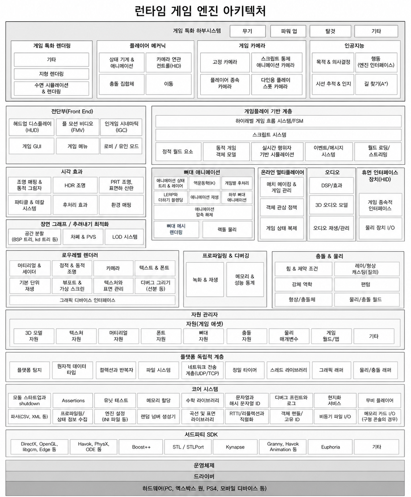
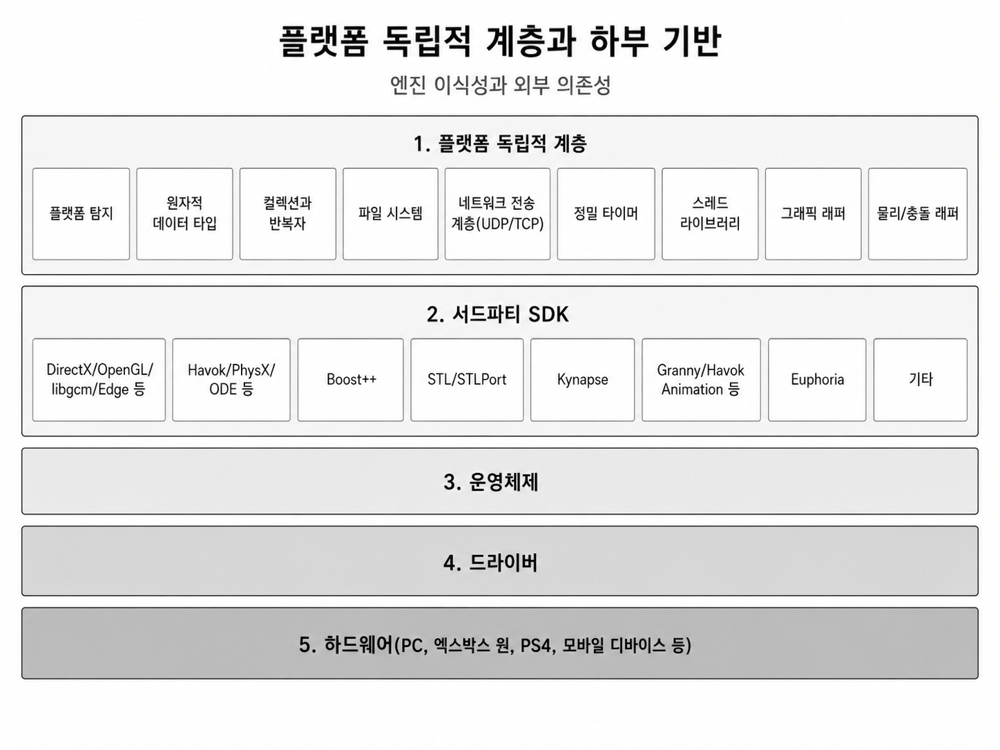
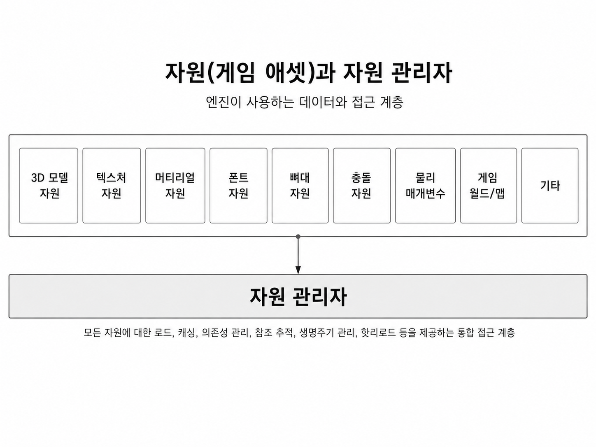
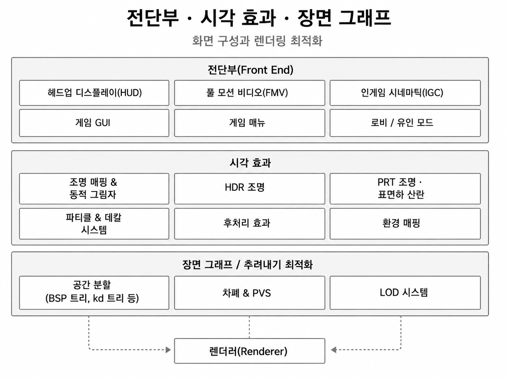
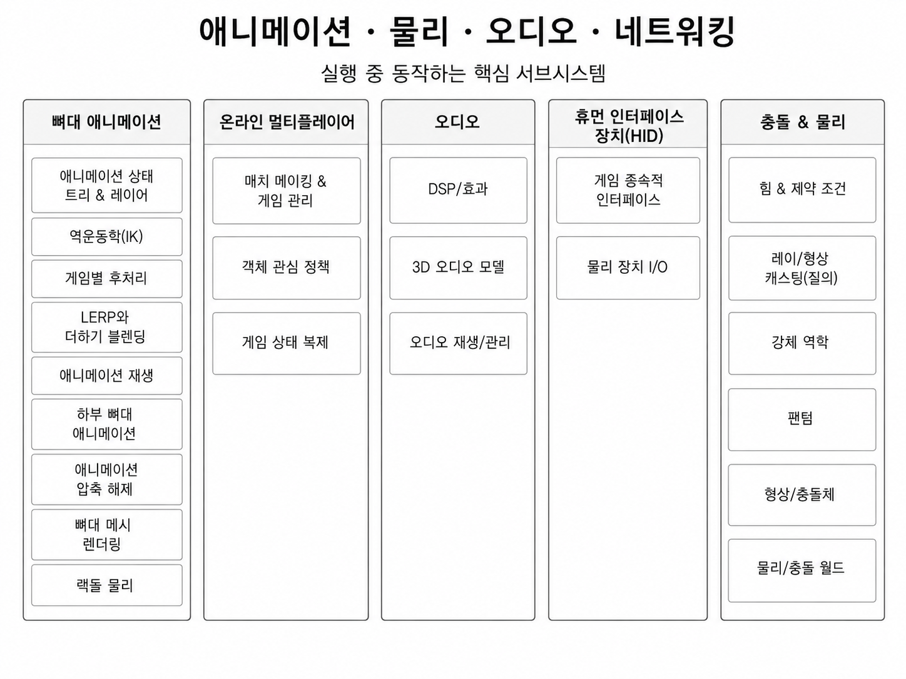
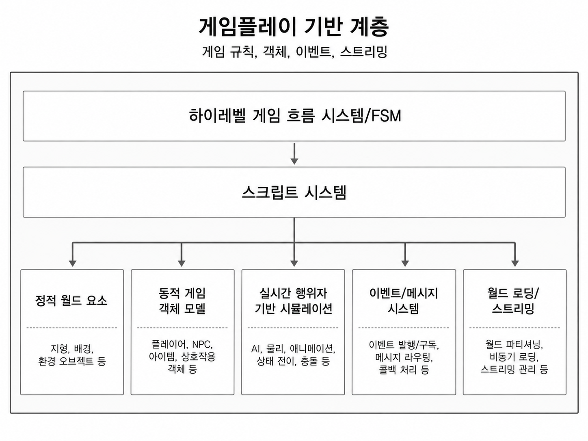
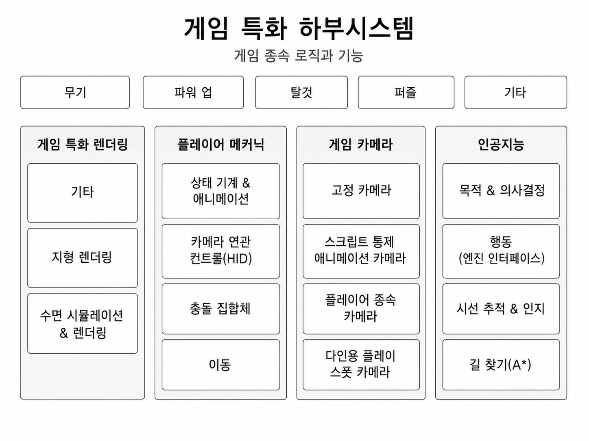
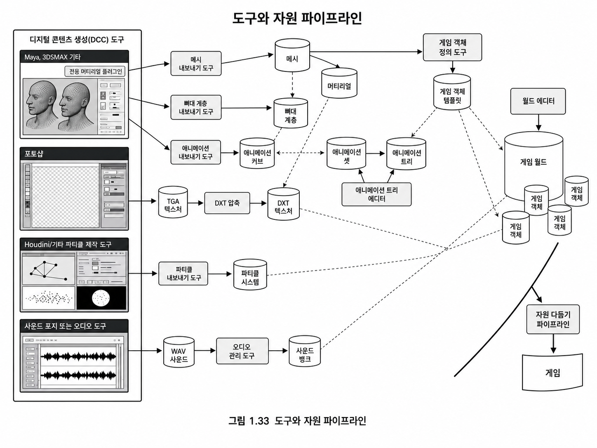
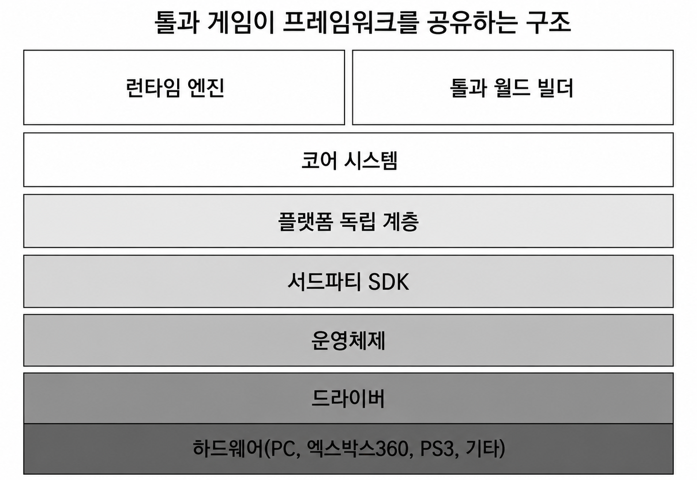
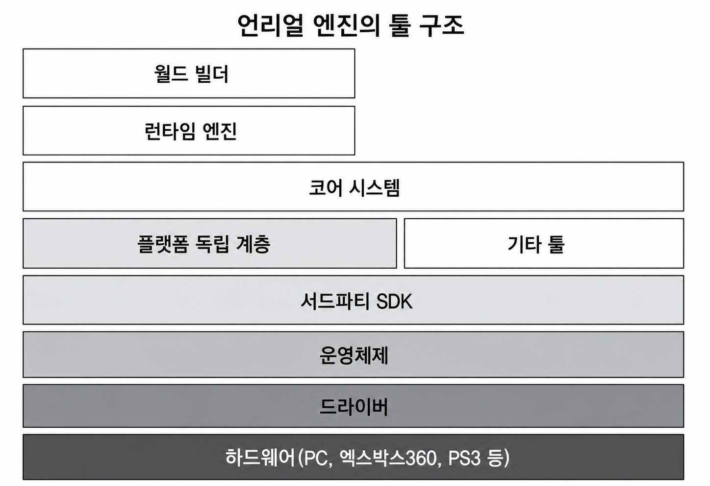

# Chapter 1. 소개 — 게임 엔진 아키텍처 큰 그림

> 기준 자료: Game Engine Architecture 1장 소개 + 개인 키워드 정리.  
> 목적: “왜 이런 계층이 필요한가?”를 이해하는 GitHub용 학습 노트로 정리한다.  
> 주의: 이 문서는 원문 번역본이 아니라, 개인 학습을 위해 AI 를 통한 보강 정리본이다.

---

## 목차

1. [이 장에서 잡아야 할 핵심](#1-이-장에서-잡아야-할-핵심)
2. [게임은 덜 엄격한 실시간 시뮬레이션이다](#2-게임은-덜-엄격한-실시간-시뮬레이션이다)
3. [런타임 게임 엔진 아키텍처 전체 그림](#3-런타임-게임-엔진-아키텍처-전체-그림)
4. [하위 계층: 하드웨어, 드라이버, OS, SDK](#4-하위-계층-하드웨어-드라이버-os-sdk)
5. [플랫폼 독립 계층과 코어 시스템](#5-플랫폼-독립-계층과-코어-시스템)
6. [자원 관리자와 엔진 데이터](#6-자원-관리자와-엔진-데이터)
7. [렌더링 엔진](#7-렌더링-엔진)
8. [전단부, UI, HUD](#8-전단부-ui-hud)
9. [프로파일링과 디버깅](#9-프로파일링과-디버깅)
10. [애니메이션, 물리, 오디오, 입력, 네트워크](#10-애니메이션-물리-오디오-입력-네트워크)
11. [게임플레이 기반 시스템](#11-게임플레이-기반-시스템)
12. [게임 특화 하부 시스템](#12-게임-특화-하부-시스템)
13. [도구와 자원 파이프라인](#13-도구와-자원-파이프라인)
14. [툴 구조: 독립 툴 vs 엔진 통합 툴](#14-툴-구조-독립-툴-vs-엔진-통합-툴)
15. [1장 최종 정리](#15-1장-최종-정리)
16. [보강 출처](#16-보강-출처)

---

## 1. 이 장에서 잡아야 할 핵심

1장은 게임 엔진을 단순히 “그래픽을 그리는 프로그램”으로 보지 않고, **런타임 엔진 + 도구 + 자원 파이프라인**이 결합된 거대한 소프트웨어 시스템으로 바라보게 만든다.

핵심은 세 가지다.

1. 게임은 **실시간 상호작용을 위한 이산 시간 시뮬레이션**이다.
2. 게임 엔진은 렌더링, 물리, 애니메이션, 오디오, 입력, 네트워크, 자원 관리, 스크립트, AI, 게임 객체 모델이 결합된 **계층적 아키텍처**다.
3. 실제 게임 개발에서는 런타임 코드만큼이나 DCC 도구, 에디터, exporter, asset conditioning pipeline, resource database 같은 **제작 파이프라인**이 중요하다.

> 한 줄 요약: 게임 엔진은 “게임을 실행하는 코드”이면서 동시에 “게임을 만들기 위한 생산 시스템”이다.

---

## 2. 게임은 덜 엄격한 실시간 시뮬레이션이다

게임은 시간에 따라 상태가 변한다. 플레이어가 입력을 넣고, 게임 객체가 움직이고, 충돌이 발생하고, 애니메이션이 재생되고, 화면이 갱신된다. 이런 점에서 게임은 시뮬레이션이다.

다만 과학·공학 시뮬레이션과 달리 게임의 목적은 현실을 최대한 정확히 계산하는 것이 아니다. 게임은 플레이어 입력에 즉시 반응해야 하므로 **정확성보다 실시간성, 상호작용성, 재미, 프레임 안정성**이 더 중요하다.

일반적인 게임 루프는 다음 흐름을 반복한다.

```text
입력 수집
→ 게임 상태 갱신
→ AI / 물리 / 애니메이션 갱신
→ 사운드 갱신
→ 렌더링
→ 다음 프레임
```

여기서 중요한 개념은 **이산 시간 단계(discrete time step)**다. 현실의 시간은 연속적이지만, 컴퓨터 게임은 보통 프레임 또는 틱 단위로 상태를 갱신한다.

```text
현재 상태 S(t)
입력 I(t)
시뮬레이션 Δt
다음 상태 S(t + Δt)
```

그래서 엔진 프로그래머는 항상 다음 질문을 생각해야 한다.

- 한 프레임 안에 어떤 시스템을 어떤 순서로 갱신할 것인가?
- 물리, 애니메이션, 네트워크, 렌더링의 시간 기준을 어떻게 맞출 것인가?
- 프레임 시간이 흔들릴 때 시뮬레이션 결과가 불안정해지지 않게 하려면 어떻게 해야 하는가?

### 장르 특화와 범용성의 트레이드오프

게임 엔진은 장르에 따라 최적화 방향이 달라진다.

| 장르 | 엔진에서 중요해지는 요소 |
|---|---|
| FPS | 입력 반응성, 카메라, 충돌, 네트워크 보정, 렌더링 최적화 |
| 오픈월드 | 월드 스트리밍, LOD, 지형, 대량 객체 관리 |
| 격투 게임 | 고정 프레임, 판정, 리플레이, 결정론적 시뮬레이션 |
| 레이싱 | 차량 물리, 트랙, 고속 충돌, 카메라 |
| MMO | 서버 아키텍처, 관심 영역, 대규모 네트워크, DB 연동 |

범용 엔진은 여러 장르를 만들 수 있게 해주지만, 특정 게임에만 맞춘 엔진보다 극단적인 최적화는 어려울 수 있다. 반대로 특정 게임만을 위해 만든 엔진은 성능은 좋을 수 있지만 재사용성과 확장성이 낮아질 수 있다.

---

## 3. 런타임 게임 엔진 아키텍처 전체 그림



위 그림은 게임 엔진이 여러 계층으로 구성된다는 점을 보여준다. 아래쪽은 하드웨어와 운영체제에 가깝고, 위쪽으로 갈수록 게임 고유 로직에 가까워진다.

대략적인 구조는 다음과 같다.

```text
게임 특화 하부 시스템
게임플레이 기반 시스템
렌더링 / 애니메이션 / 물리 / 오디오 / 네트워크 / 입력
자원 관리자
코어 시스템
플랫폼 독립 계층
서드파티 SDK / 미들웨어
운영체제
드라이버
하드웨어
```

이 그림에서 가장 중요한 포인트는 **게임 엔진은 렌더러 하나가 아니라는 것**이다. 렌더링은 매우 중요한 하부 시스템이지만, 엔진 전체 관점에서는 자원 관리, 객체 모델, 이벤트, 스크립트, 오디오, 입력, 네트워크, 툴 체인과 함께 동작해야 한다.

예를 들어 캐릭터 하나를 화면에 띄우는 과정만 봐도 여러 시스템이 동시에 필요하다.

```text
자원 관리자: 캐릭터 메시, 텍스처, 머티리얼, 애니메이션 로드
애니메이션 시스템: 현재 포즈 계산
게임플레이 시스템: 캐릭터 상태와 입력 처리
물리 시스템: 충돌과 이동 처리
렌더링 엔진: 스키닝 결과를 화면에 출력
오디오 시스템: 발소리, 피격음 재생
네트워크 시스템: 멀티플레이 상태 동기화
```

따라서 엔진 아키텍처를 공부할 때는 “각 시스템이 무엇을 하는가?”뿐 아니라, **서로 어떤 데이터를 주고받는가?**, **어느 계층까지 의존해도 되는가?**, **런타임과 툴에서 같은 데이터를 어떻게 공유하는가?**를 봐야 한다.

---

## 4. 하위 계층: 하드웨어, 드라이버, OS, SDK



### 4.1 하드웨어와 드라이버

가장 아래에는 PC, 콘솔, 모바일 기기 같은 목표 하드웨어가 있다. 그 위에는 그래픽 드라이버, 오디오 드라이버, 입력 장치 드라이버처럼 하드웨어와 OS 사이를 연결하는 구성 요소가 있다.

엔진 프로그래머가 이 계층을 매일 직접 다루는 것은 아니지만, 성능 문제를 추적하다 보면 결국 GPU, CPU, 메모리 대역폭, 드라이버 오버헤드, I/O 속도 같은 하드웨어 특성을 이해해야 한다.

예를 들어 렌더링 최적화에서 병목이 CPU인지 GPU인지에 따라 해결책이 완전히 달라진다.

```text
CPU 병목: draw call 수, scene traversal, animation update, culling 비용
GPU 병목: shader 비용, overdraw, shadow map, post-processing, bandwidth
I/O 병목: asset streaming, texture loading, shader cache loading
```

### 4.2 운영체제

운영체제는 파일 시스템, 네트워크, 스레드, 프로세스, 타이머, 메모리 관리 같은 기본 기능을 제공한다. 게임은 OS 위에서 실행되므로 OS의 제약을 완전히 벗어날 수 없다.

다만 엔진 코드가 운영체제 API에 직접 강하게 묶이면 이식성이 떨어진다. Windows API에 직접 의존한 코드가 많으면 콘솔이나 Linux, 모바일로 옮길 때 수정 범위가 커진다.

그래서 엔진은 보통 다음과 같은 기능을 자체 인터페이스로 감싼다.

- 파일 I/O
- 스레드와 락
- 타이머
- 네트워크 소켓
- 동적 라이브러리 로딩
- 경로 처리
- 창 생성과 입력 이벤트

### 4.3 서드파티 SDK와 미들웨어

게임 엔진은 모든 기능을 처음부터 직접 만들지 않는다. 검증된 SDK와 미들웨어를 붙여 개발 기간을 줄이고 안정성을 확보한다.

| 분야 | 예시 |
|---|---|
| 그래픽스 API | Direct3D, Vulkan, OpenGL |
| 물리/충돌 | PhysX, Havok, ODE |
| 오디오 | XAudio2, Wwise, FMOD |
| 애니메이션 | Granny, Havok Animation |
| AI 내비게이션 | Gameware Navigation, Recast/Detour 계열 |
| 범용 C++ 라이브러리 | Boost, C++ Standard Library |

여기서 SDK와 API를 구분하면 다음과 같다.

```text
SDK: 라이브러리, 헤더, 도구, 문서, 샘플을 포함한 개발 도구 묶음
API: 그 SDK나 시스템을 사용하기 위해 호출하는 함수/클래스/인터페이스
```

### 보강: C++ 표준 라이브러리와 STL 표현

개인 정리에서 “STL이라는 이름이 약간 헷갈린다”는 메모가 있었는데, 정확히는 **C++ Standard Library**가 공식 명칭이다. 다만 역사적으로 컨테이너, 반복자, 알고리즘 계열을 가리켜 STL이라는 표현이 널리 쓰였고, 지금도 문서나 개발자 커뮤니티에서 관용적으로 사용된다. Microsoft 문서도 공식 명칭은 C++ Standard Library라고 설명하면서, 검색 편의상 STL이라는 표현이 사용된다고 밝힌다.

엔진 관점에서 중요한 건 명칭보다도 다음이다.

- 표준 라이브러리는 생산성을 높인다.
- 하지만 실시간 엔진에서는 메모리 할당, iterator invalidation, 캐시 효율, 디버그 가능성을 고려해야 한다.
- 그래서 많은 엔진은 `std::vector`를 그대로 쓰기도 하지만, 자체 allocator나 자체 container를 함께 제공하기도 한다.

---

## 5. 플랫폼 독립 계층과 코어 시스템

### 5.1 플랫폼 독립 계층

플랫폼 독립 계층은 플랫폼마다 다른 API를 엔진 내부의 공통 인터페이스로 감싸는 부분이다.

예를 들어 게임 코드에서 Windows의 `CreateFile`, `CreateThread`, `QueryPerformanceCounter` 같은 함수를 직접 호출하지 않고, 엔진의 `FileSystem`, `Thread`, `Timer` 같은 추상화 계층을 사용하게 만든다.

```text
Game Code
  ↓
Engine Platform API
  ↓
Windows / PlayStation / Xbox / Switch / Linux / Android / iOS API
```

이 계층이 필요한 이유는 다음과 같다.

- 플랫폼별 코드가 게임플레이 코드에 퍼지는 것을 막는다.
- 새 플랫폼 대응 시 수정 범위를 줄인다.
- 테스트용 mock 구현을 만들기 쉬워진다.
- 파일 경로, endian, alignment, thread primitive 차이를 한곳에서 관리할 수 있다.

### 5.2 코어 시스템

코어 시스템은 엔진 전체에서 공통으로 사용하는 기반 유틸리티다.

대표 기능은 다음과 같다.

| 코어 기능 | 설명 |
|---|---|
| 메모리 할당 | frame allocator, pool allocator, stack allocator, tracking allocator 등 |
| assertion | 잘못된 상태를 빠르게 발견하기 위한 방어 코드 |
| logging | 디버그 메시지, 에러 기록, 카테고리별 로그 제어 |
| 수학 라이브러리 | vector, matrix, quaternion, transform, intersection test |
| 문자열/해시 | 이름 검색, asset key, object id 등에 사용 |
| 파일 I/O | 동기/비동기 로딩, 패키지 파일, streaming |
| 테스트 | unit test, automation test, regression test |
| 프로파일링 | CPU/GPU 시간 측정, 메모리 사용량 추적 |

코어 시스템은 화려해 보이지 않지만, 엔진 품질을 좌우한다. 특히 게임은 프레임 단위로 실행되는 실시간 프로그램이므로 **메모리 할당 패턴**, **캐시 효율**, **락 경합**, **디버그 가능성**이 매우 중요하다.

> 엔진 코드에서 “기능이 돌아간다”와 “실시간으로 안정적으로 돌아간다”는 다르다. 코어 시스템은 후자를 가능하게 하는 기반이다.

---

## 6. 자원 관리자와 엔진 데이터



자원 관리자는 게임 엔진의 모든 asset과 engine data에 접근하는 통일된 인터페이스를 제공한다.

게임에서 사용하는 자원은 매우 다양하다.

- 3D 모델
- 텍스처
- 머티리얼
- 셰이더
- 폰트
- 뼈대와 애니메이션
- 충돌 데이터
- 물리 메타데이터
- 오디오 클립과 사운드 뱅크
- 게임 월드와 레벨
- 스크립트와 설정 파일

자원 관리자가 없다면 각 시스템이 파일을 제각각 읽고, 로딩 순서와 참조 관계를 직접 관리해야 한다. 프로젝트가 커질수록 이런 방식은 금방 무너진다.

자원 관리자의 역할은 다음과 같다.

```text
asset id / path / name 관리
의존성 추적
동기/비동기 로딩
메모리 상주 여부 관리
참조 카운팅 또는 lifetime 관리
패키징된 데이터 접근
streaming 지원
hot reload 또는 editor 연동
```

### Unreal의 예: Asset Manager와 Asset Registry

Unreal Engine은 asset을 primary asset과 secondary asset으로 나누어 관리할 수 있는 Asset Manager 시스템을 제공한다. 또한 Asset Registry는 에디터가 asset을 직접 로드하지 않고도 asset 정보를 비동기적으로 수집하고, Content Browser 같은 에디터 시스템이 이를 활용할 수 있게 한다.

이 개념은 책의 자원 관리자 설명과 잘 연결된다.

```text
런타임 관점: 필요한 asset을 언제, 어떻게 로드할 것인가?
에디터 관점: 수많은 asset을 로드하지 않고도 검색/분류/참조 추적을 어떻게 할 것인가?
```

---

## 7. 렌더링 엔진



렌더링 엔진은 게임 월드의 상태를 화면 이미지로 변환하는 시스템이다. 하지만 단순히 `Draw()`를 호출하는 계층이 아니라, 카메라, 머티리얼, 조명, 가시성 판단, 셰이더, 후처리, 디버그 렌더링까지 포함하는 큰 하부 시스템이다.

### 7.1 로우레벨 렌더러

로우레벨 렌더러는 그래픽 API와 직접 맞닿는 계층이다.

주요 역할은 다음과 같다.

- 그래픽 디바이스 초기화
- swap chain, back buffer, depth/stencil buffer 설정
- render target 관리
- vertex/index buffer 관리
- texture, sampler, shader 관리
- pipeline state 설정
- draw call 제출
- viewport와 scissor 설정

Direct3D 12 문서에서는 그래픽 파이프라인을 GPU가 프레임을 렌더링할 때 데이터가 입력에서 출력으로 흐르는 순차적 과정으로 설명한다. 즉 렌더러는 CPU에서 “무엇을 어떻게 그릴지”를 구성하고, GPU는 설정된 pipeline state와 입력 데이터를 바탕으로 이미지를 생성한다.

```text
Mesh / Vertex Buffer
→ Vertex Shader
→ Rasterizer
→ Pixel Shader
→ Render Target
```

실제 현대 렌더링은 이보다 훨씬 복잡하다. shadow pass, depth pre-pass, g-buffer, deferred lighting, forward pass, transparency, post-processing, UI pass 등이 여러 단계로 나뉠 수 있다.

### 7.2 머티리얼과 셰이더

머티리얼은 물체가 어떻게 보일지 정의하는 데이터다.

보통 다음 정보를 포함한다.

- base color texture
- normal map
- roughness / metallic 값
- shader program
- render state
- blending mode
- culling mode
- depth test/write 설정

로우레벨 렌더러는 머티리얼 정보를 바탕으로 적절한 셰이더와 GPU 상태를 설정하고 geometry primitive를 그린다.

### 7.3 장면 그래프와 가시성 판단

로우레벨 렌더러가 모든 객체를 무작정 그리면 성능이 크게 떨어진다. 그래서 상위 계층에서 **보이는 객체만 고르는 작업**이 필요하다.

대표적인 최적화는 다음과 같다.

| 기법 | 의미 |
|---|---|
| Frustum Culling | 카메라 시야 밖 객체 제거 |
| Occlusion Culling | 다른 물체에 가려진 객체 제거 |
| PVS | 특정 위치에서 보일 가능성이 있는 객체 집합을 미리 계산 |
| BSP / Octree / kd-tree | 공간을 나누어 검색 비용 감소 |
| LOD | 거리에 따라 저비용 모델 사용 |

핵심은 “렌더링할 필요가 없는 것을 그리지 않는 것”이다. 실시간 렌더링에서 가장 좋은 최적화는 종종 더 빠르게 그리는 것이 아니라 **아예 그리지 않는 것**이다.

### 7.4 시각 효과

시각 효과는 게임의 분위기와 타격감을 크게 좌우한다.

대표적인 효과는 다음과 같다.

- 파티클 시스템
- 데칼 시스템
- 동적 그림자
- 환경 매핑
- 라이트맵
- HDR
- bloom
- color grading
- motion blur
- depth of field
- full-screen post-processing

시각 효과 시스템은 렌더링 엔진 내부에 포함되기도 하고, VFX 전용 시스템으로 분리되기도 한다. 중요한 것은 아티스트가 반복 작업을 빠르게 할 수 있도록 에디터와 연동되는 경우가 많다는 점이다.

---

## 8. 전단부, UI, HUD

전단부(front end)는 게임 화면 위에 올라가는 2D/3D 인터페이스 계층이다.


대표 요소는 다음과 같다.

- HUD
- 게임 GUI
- 게임 메뉴
- 일시정지 메뉴
- 인게임 시네마틱
- 콘솔
- 디버그 오버레이
- 개발자용 툴 UI

UI는 단순히 예쁜 화면을 만드는 문제가 아니다. 실제 엔진에서는 입력 처리, 해상도 대응, localization, font atlas, animation, sound feedback, focus navigation, gamepad 조작까지 고려해야 한다.

특히 콘솔과 PC를 함께 지원하는 게임은 마우스/키보드와 게임패드 UI 흐름이 모두 자연스러워야 한다.

---

## 9. 프로파일링과 디버깅

게임 엔진은 실시간 프로그램이므로 “버그가 없다”만으로 충분하지 않다. **프레임 시간 안에 안정적으로 실행되는지**를 계속 측정해야 한다.

프로파일링과 디버깅 시스템은 다음 기능을 제공한다.

- CPU 구간별 실행 시간 측정
- GPU pass별 실행 시간 측정
- 메모리 사용량 추적
- peak memory 측정
- allocation callstack 추적
- 로그 카테고리 제어
- 게임 화면 위 debug overlay 출력
- gameplay recording/replay
- crash dump 생성
- 네트워크 패킷 기록
- 성능 데이터를 파일이나 스프레드시트로 export

게임 엔진은 보통 외부 도구도 사용하지만, 엔진 내부에 자체 계측 시스템을 넣는 경우가 많다. 이유는 게임 시스템별 의미 있는 정보를 가장 잘 아는 쪽이 엔진 자신이기 때문이다.

```text
외부 프로파일러: CPU/GPU의 일반적인 병목 확인
엔진 내부 프로파일러: Tick, Animation, Physics, Render, AI 등 게임 시스템별 병목 확인
```

엔진 프로그래머에게 중요한 태도는 “느린 것 같다”가 아니라 **측정해서 확인한다**는 것이다.

---

## 10. 애니메이션, 물리, 오디오, 입력, 네트워크



### 10.1 애니메이션 시스템

애니메이션 시스템은 캐릭터와 객체의 움직임을 계산한다.

대표 방식은 다음과 같다.

| 방식 | 설명 |
|---|---|
| 스프라이트 애니메이션 | 2D 이미지 프레임을 바꿔가며 재생 |
| rigid body 계층 애니메이션 | 부모-자식 transform 계층으로 움직임 표현 |
| 뼈대 애니메이션 | skeleton joint pose를 계산하고 mesh skinning 수행 |
| 정점 애니메이션 | vertex 위치 자체를 프레임별로 저장/변형 |
| morph target | 표정처럼 특정 vertex delta를 섞어서 변형 |
| ragdoll | 물리 시스템으로 관절 움직임을 시뮬레이션 |

현대 3D 게임에서 가장 널리 쓰이는 방식은 뼈대 애니메이션이다. 애니메이션 시스템이 각 관절의 pose를 계산하면, 렌더러는 skinning을 통해 메시 정점을 최종 위치로 변환한다.

```text
Animation Clip
→ Skeleton Pose
→ Joint Matrix Palette
→ Skinning
→ Rendered Mesh
```

### 10.2 충돌과 물리

물리 시스템은 객체가 서로 부딪히고, 중력과 힘에 의해 움직이는 과정을 계산한다.

주요 기능은 다음과 같다.

- raycast
- overlap test
- sweep test
- collision detection
- rigid body dynamics
- constraints/joints
- character controller
- trigger volume
- ragdoll simulation

NVIDIA PhysX 같은 물리 엔진은 rigid body dynamics, scene query, collision 기능을 제공한다. 게임 개발사는 이런 미들웨어를 그대로 쓰거나, 게임에 맞게 감싼 wrapper 계층을 둔다.

물리 시스템에서 중요한 점은 “현실처럼 정확한 물리”가 아니라 “게임플레이에 맞는 안정적인 물리”다. 예를 들어 캐릭터 이동은 완전한 물리 시뮬레이션보다 예측 가능하고 조작감 좋은 character controller가 더 적합할 수 있다.

### 10.3 오디오

오디오는 단순히 wav 파일을 재생하는 시스템이 아니다.

실제 오디오 엔진은 다음을 담당한다.

- sound effect 재생
- music system
- 3D positional audio
- reverb / occlusion / obstruction
- mixing
- DSP effect
- streaming
- sound bank 로딩
- platform-specific audio output

Microsoft XAudio2는 게임용 고성능 오디오 엔진을 개발하기 위한 low-level audio API로 소개된다. 즉 XAudio2 같은 API는 최종 게임 오디오 시스템 전체라기보다, 그 아래에서 신호 처리와 믹싱 기반을 제공하는 계층에 가깝다.

### 10.4 입력 장치

입력 시스템은 키보드, 마우스, 게임패드, 터치, VR 컨트롤러 같은 장치의 입력을 게임 명령으로 변환한다.

```text
Raw Input
→ Device Abstraction
→ Action Mapping
→ Gameplay Command
```

좋은 입력 시스템은 특정 장치에 묶이지 않고, “Jump”, “Attack”, “Interact” 같은 의미 단위 action으로 추상화한다.

### 10.5 온라인 멀티플레이어와 네트워크

멀티플레이를 지원할 게임이라면 네트워크 구조는 초기에 고려해야 한다. 나중에 싱글플레이 구조에 네트워크를 억지로 붙이면 객체 소유권, 동기화, 예측, 보정, 보안 문제가 크게 터질 수 있다.

멀티플레이 유형은 다음과 같이 나눌 수 있다.

| 유형 | 설명 |
|---|---|
| 단일 화면 멀티 | 같은 화면에서 여러 플레이어가 조작 |
| 분할 화면 멀티 | 한 기기에서 화면을 나누어 플레이 |
| 네트워크 멀티 | LAN/인터넷을 통한 동기화 |
| 대규모 멀티 | MMO처럼 많은 유저가 같은 월드 또는 shard에 접속 |

네트워크 엔진에서 중요한 질문은 다음과 같다.

- 서버 권위 구조인가, P2P인가?
- 어떤 객체를 누구에게 동기화할 것인가?
- 위치와 상태를 얼마나 자주 보낼 것인가?
- 지연 시간과 패킷 손실을 어떻게 보정할 것인가?
- 치팅을 어떻게 막을 것인가?

---

## 11. 게임플레이 기반 시스템



게임플레이 기반 시스템은 실제 게임 규칙과 객체 상태를 표현하는 계층이다.

### 11.1 게임 월드와 객체 모델

게임 월드는 캐릭터, NPC, 무기, 탈것, 카메라, 조명, 트리거, 아이템, 투사체 같은 객체들로 구성된다.

객체 모델을 설계할 때는 다음 질문이 중요하다.

- 객체는 class inheritance로 표현할 것인가, component 조합으로 표현할 것인가?
- 객체 ID는 어떻게 부여할 것인가?
- 객체 lifetime은 누가 관리할 것인가?
- 다른 객체를 참조할 때 raw pointer를 쓸 것인가, handle을 쓸 것인가?
- serialize/deserialize는 어떻게 할 것인가?
- 네트워크 복제 대상 객체는 어떻게 구분할 것인가?

현대 엔진은 보통 component 기반 구조를 많이 사용한다.

```text
GameObject / Actor
  ├─ Transform Component
  ├─ Mesh Component
  ├─ Physics Component
  ├─ Audio Component
  └─ Gameplay Script Component
```

상속 구조만으로 모든 객체를 표현하면 조합 폭발이 일어날 수 있다. 그래서 객체는 얇게 두고, 기능은 component로 붙이는 방식이 많이 쓰인다.

### 11.2 이벤트/메시지 시스템

이벤트 시스템은 객체들이 서로 느슨하게 통신하게 만든다.

예를 들어 플레이어가 아이템을 먹었을 때 다음과 같은 이벤트가 발생할 수 있다.

```text
ItemPickedUpEvent
  playerId
  itemId
  itemType
```

이 이벤트를 UI, 사운드, 퀘스트 시스템, 인벤토리 시스템이 각각 받아 처리할 수 있다.

이벤트 시스템의 장점은 시스템 간 결합도를 낮춘다는 것이다. 단점은 흐름이 눈에 잘 보이지 않아 디버깅이 어려워질 수 있다는 점이다. 그래서 좋은 로그와 디버그 시각화가 필요하다.

### 11.3 스크립트 시스템

스크립트 시스템은 게임 규칙과 콘텐츠를 빠르게 수정하기 위해 사용된다.

스크립트가 없으면 작은 규칙 변경에도 C++ 코드를 다시 컴파일하고 링크해야 한다. 반면 스크립트나 비주얼 스크립팅을 사용하면 디자이너가 직접 게임플레이를 조정할 수 있고, 반복 속도가 빨라진다.

대표적인 예시는 다음과 같다.

- Lua 기반 스크립트
- Python 기반 툴 스크립트
- Unreal Blueprint
- Unity C# script
- 자체 DSL 또는 visual scripting

엔진 관점에서 스크립트 시스템의 핵심은 C++ 객체와 스크립트 객체 사이의 바인딩, lifetime, reflection, serialization, hot reload를 어떻게 처리하느냐다.

### 11.4 AI 시스템

AI 시스템은 NPC의 의사결정, 경로 탐색, 인식, 행동 선택을 담당한다.

대표 기능은 다음과 같다.

- pathfinding
- navigation mesh
- steering
- behavior tree
- finite state machine
- perception system
- decision making

AI는 단독으로 동작하지 않는다. 월드의 collision data, navigation data, animation, gameplay state와 계속 연결된다.

---

## 12. 게임 특화 하부 시스템



게임 특화 하부 시스템은 특정 장르나 게임에만 필요한 시스템이다.

예시는 다음과 같다.

| 게임 특화 시스템 | 설명 |
|---|---|
| 무기 시스템 | 총기, 탄약, 반동, 재장전, 피격 판정 |
| 파워업 | 버프, 지속 시간, 중첩 규칙 |
| 탈것 | 차량 입력, 탑승/하차, 차량 물리 |
| 퍼즐 | 스위치, 트리거, 상태 조합 |
| 목표/의사결정 | NPC 목표, 퀘스트 목표, 전략적 판단 |
| 엔진 인터페이스 | 특정 게임만의 엔진 확장 지점 |

책에서 이 계층이 맨 위에 있는 이유는, 이 계층이 아래 엔진 시스템들을 활용해 “게임 자체”를 만들기 때문이다.

예를 들어 FPS의 무기 시스템은 렌더링, 애니메이션, 오디오, 물리, 입력, 네트워크, UI를 모두 사용한다.

```text
마우스 클릭
→ 입력 시스템
→ 무기 시스템
→ raycast / projectile
→ 피격 판정
→ 애니메이션 재생
→ 사운드 재생
→ 이펙트 생성
→ UI 탄약 갱신
→ 네트워크 복제
```

즉 게임 특화 시스템은 엔진 아키텍처의 소비자이면서, 동시에 실제 플레이 경험을 만드는 최종 계층이다.

---

## 13. 도구와 자원 파이프라인

게임 엔진이 실행되려면 막대한 양의 데이터가 필요하다. 이 데이터는 대부분 사람이 직접 코드로 작성하지 않는다. 아티스트, 디자이너, 사운드 디자이너가 DCC 도구와 에디터를 사용해 만든다.



### 13.1 DCC 도구

DCC는 Digital Content Creation의 약자다. 게임에 들어갈 원본 콘텐츠를 만드는 도구를 의미한다.

대표 예시는 다음과 같다.

| 자원 | DCC 도구 예시 |
|---|---|
| 3D 모델 | Maya, 3ds Max, Blender |
| 텍스처 | Photoshop, Substance 3D Painter |
| 파티클/VFX | Houdini, Niagara, 자체 VFX editor |
| 오디오 | Pro Tools, Reaper, Audition |
| 월드/레벨 | Unreal Editor, Unity Editor, 자체 World Editor |

DCC 도구에서 만든 원본 파일은 보통 게임 런타임이 직접 사용하기에 적합하지 않다. 파일이 무겁고, 로딩이 느리고, 불필요한 저작 정보가 많고, 엔진 내부 자료구조와 맞지 않을 수 있기 때문이다.

### 13.2 Export와 Asset Conditioning Pipeline

그래서 DCC 데이터는 exporter를 거쳐 엔진이 읽기 쉬운 중간 포맷이나 최종 런타임 포맷으로 변환된다. 이 과정을 asset conditioning pipeline 또는 asset build pipeline이라고 볼 수 있다.

```text
DCC 원본 파일
→ Exporter
→ 중간 포맷
→ 검증 / 최적화 / 압축 / 변환
→ 런타임 포맷
→ 패키징
→ 게임에서 로딩
```

이 단계에서 하는 일은 다음과 같다.

- 메시 삼각형화
- 좌표계 변환
- 단위 변환
- 불필요한 데이터 제거
- 텍스처 압축
- mipmap 생성
- 애니메이션 압축
- collision mesh 생성
- LOD 생성
- asset dependency 기록
- 플랫폼별 포맷 변환

Unity 문서에서도 asset workflow는 프로젝트의 Assets 폴더에 들어온 asset을 import하고, 필요하면 import 과정에서 asset을 처리하는 스크립트를 작성할 수 있다고 설명한다. 즉 현대 엔진은 단순히 파일을 복사해서 쓰는 것이 아니라, import/build 단계에서 런타임에 적합한 형태로 데이터를 가공한다.

### 13.3 런타임 게임 월드와 자원 로딩

가공된 자원은 런타임에서 게임 월드와 게임 객체에 연결된다.

예를 들어 캐릭터 하나를 배치하려면 다음 데이터가 연결될 수 있다.

```text
Skeletal Mesh
Skeleton
Animation Clip
Animation Blueprint / State Machine
Physics Asset
Material
Texture
Sound Cue
Gameplay Data
```

월드 에디터는 이 모든 것을 한곳에서 조립하는 도구다. 디자이너는 월드에 객체를 배치하고, 아티스트는 메시와 머티리얼을 확인하고, 프로그래머는 게임플레이 로직과 디버그 정보를 연결한다.

### 13.4 자원 데이터베이스

프로젝트가 커질수록 asset은 단순 파일 목록이 아니라 metadata가 붙은 데이터베이스가 된다.

예를 들어 애니메이션 하나에도 다음 정보가 필요할 수 있다.

```text
고유 ID
소스 파일 경로
export된 런타임 파일 경로
프레임 범위
loop 여부
압축 방식
압축 레벨
사용 skeleton
참조 중인 캐릭터
플랫폼별 build 상태
```

이런 metadata를 제대로 관리하지 않으면 다음 문제가 생긴다.

- 삭제하면 안 되는 asset을 삭제한다.
- 사용하지 않는 asset이 계속 빌드에 포함된다.
- 참조가 깨져 런타임에서 로딩 실패가 발생한다.
- 플랫폼별 포맷이 섞인다.
- 빌드 시간이 과도하게 증가한다.

그래서 자원 데이터베이스, asset registry, source control 연동, dependency graph가 중요해진다.

---

## 14. 툴 구조: 독립 툴 vs 엔진 통합 툴

게임 제작 툴은 크게 두 방향으로 볼 수 있다.

### 14.1 툴과 게임이 프레임워크를 공유하는 구조



이 구조에서는 런타임 엔진과 월드 빌더가 코어 시스템, 플랫폼 계층, 서드파티 SDK, OS 계층을 공유한다.

장점은 다음과 같다.

- 툴과 게임이 같은 기반 코드를 사용한다.
- 런타임과 유사한 환경에서 데이터를 검증할 수 있다.
- 툴 전용 코드와 게임 코드의 중복을 줄일 수 있다.

단점은 다음과 같다.

- 엔진 변경이 툴 안정성에 영향을 줄 수 있다.
- 툴 실행이 엔진 초기화 비용에 묶일 수 있다.
- 툴과 런타임의 release cycle이 강하게 연결될 수 있다.

### 14.2 Unreal Engine처럼 에디터가 엔진에 통합된 구조



Unreal Editor는 게임 엔진에 강하게 통합된 에디터 구조의 대표적인 예다. 에디터가 엔진의 자료구조에 직접 접근할 수 있으므로, 툴과 런타임이 같은 데이터를 서로 다른 형태로 따로 유지할 필요가 적다.

장점은 다음과 같다.

- 에디터에서 게임 데이터를 직접 보고 수정하기 쉽다.
- PIE처럼 에디터 안에서 빠르게 실행 테스트를 할 수 있다.
- asset, level, actor, component, blueprint를 통합적으로 다룰 수 있다.
- 프로그래머와 디자이너의 반복 작업 속도가 빨라진다.

단점도 있다.

- 엔진이 크래시하면 에디터 작업도 중단될 수 있다.
- 에디터와 런타임 의존성이 너무 강해지면 구조가 복잡해진다.
- 툴 전용 코드와 런타임 코드의 경계를 잘 관리해야 한다.

### 14.3 웹 기반 사용자 인터페이스

웹 기반 툴은 브라우저에서 실행되므로 배포와 업데이트가 쉽다. 사용자는 별도 설치 없이 페이지를 새로고침하거나 브라우저를 재시작하면 최신 버전을 사용할 수 있다.

웹 기반 툴이 잘 맞는 경우는 다음과 같다.

- 테이블형 데이터 편집
- 아이템 데이터 관리
- 밸런스 수치 조정
- localization string 관리
- 운영툴/관리자툴
- QA 리포트 확인

다만 3D 월드 편집, 대규모 scene 조작, 실시간 preview가 필요한 툴은 네이티브 에디터나 엔진 통합 에디터가 더 적합할 수 있다.

---

## 15. 1장 최종 정리

1장은 세부 구현보다 **큰 지도**를 제공하는 장이다. 이 장을 읽고 나면 각 시스템을 따로 외우기보다, “게임 엔진이 왜 이런 구조를 가질 수밖에 없는가?”를 이해해야 한다.

### 반드시 기억할 키워드

```text
실시간 시뮬레이션
이산 시간 단계
게임 루프
장르 특화 vs 범용성
런타임 엔진
플랫폼 독립 계층
코어 시스템
자원 관리자
렌더링 엔진
애니메이션 시스템
물리/충돌 시스템
오디오 시스템
입력 시스템
네트워크 시스템
게임 객체 모델
이벤트/메시지 시스템
스크립트 시스템
AI 시스템
게임 특화 하부 시스템
DCC 도구
Exporter
Asset Conditioning Pipeline
Resource Database
World Editor
Editor Integration
```

### 엔진 프로그래머 관점의 핵심 질문

- 이 시스템은 어느 계층에 속하는가?
- 상위 계층이 하위 계층에 얼마나 의존하는가?
- 런타임과 에디터가 같은 데이터를 공유하는가, 따로 변환하는가?
- asset은 언제 로드되고 언제 해제되는가?
- 프레임 안에서 각 시스템은 어떤 순서로 갱신되는가?
- 병목이 생겼을 때 어떤 계층을 측정해야 하는가?
- 특정 장르에 맞춘 최적화와 범용성 사이에서 무엇을 선택할 것인가?

## 16. 보강 출처

아래 자료는 원서의 키워드 정리를 보강하기 위해 참고한 신뢰 가능한 공개 자료다.

### 원전

- Jason Gregory, *Game Engine Architecture*, 3rd Edition, CRC Press.

### 공식/기술 문서

- Epic Games, [Asset Management in Unreal Engine](https://dev.epicgames.com/documentation/unreal-engine/asset-management-in-unreal-engine)
- Epic Games, [Asset Registry in Unreal Engine](https://dev.epicgames.com/documentation/unreal-engine/asset-registry-in-unreal-engine)
- Unity Technologies, [Asset Workflow - Unity Manual](https://docs.unity3d.com/2021.3/Documentation/Manual/AssetWorkflow.html)
- Microsoft Learn, [Direct3D 11 Graphics Pipeline](https://learn.microsoft.com/en-us/windows/win32/direct3d11/overviews-direct3d-11-graphics-pipeline)
- Microsoft Learn, [Direct3D 12 Pipelines and Shaders](https://learn.microsoft.com/en-us/windows/win32/direct3d12/pipelines-and-shaders-with-directx-12)
- Khronos Group, [Vulkan Tutorial - Introduction](https://docs.vulkan.org/tutorial/latest/00_Introduction.html)
- NVIDIA Developer, [PhysX SDK](https://developer.nvidia.com/physx-sdk)
- NVIDIA PhysX Documentation, [Rigid Body Overview](https://nvidia-omniverse.github.io/PhysX/physx/5.6.1/docs/RigidBodyOverview.html)
- Microsoft Learn, [XAudio2 Introduction](https://learn.microsoft.com/en-us/windows/win32/xaudio2/xaudio2-introduction)
- Microsoft Learn, [C++ Standard Library Reference](https://learn.microsoft.com/en-us/cpp/standard-library/cpp-standard-library-reference)

---

